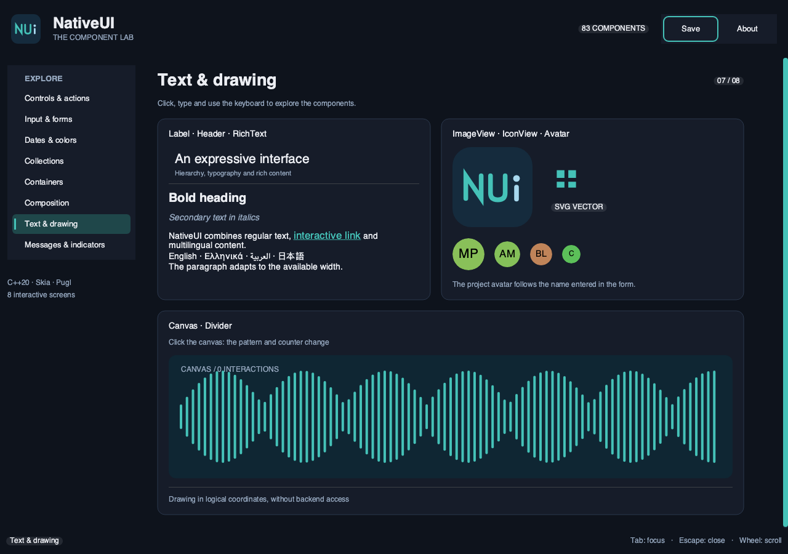

# NativeUI demo gallery

The **NativeUI — The Component Lab** application uses all **83 public components** in the [catalog](widgets.md), across eight interactive screens in English. Its final source is [examples/features/widgets_gallery.cpp](../examples/features/widgets_gallery.cpp). It uses the current public APIs, with `NativeUI::Core` for widgets and the NativeUI platform for its window.



## Launch the application

The macOS bundle built in this repository is located here:

```text
/Volumes/T7/Code/nativeui/build-widgets/nativeui_example_widgets_gallery.app
```

```sh
open /Volumes/T7/Code/nativeui/build-widgets/nativeui_example_widgets_gallery.app
```

To rebuild using the existing configuration:

```sh
TMPDIR=/Volumes/T7/tmp TMP=/Volumes/T7/tmp TEMP=/Volumes/T7/tmp CMAKE_BUILD_PARALLEL_LEVEL=1 cmake -S /Volumes/T7/Code/nativeui -B /Volumes/T7/Code/nativeui/build-widgets
TMPDIR=/Volumes/T7/tmp TMP=/Volumes/T7/tmp TEMP=/Volumes/T7/tmp CMAKE_BUILD_PARALLEL_LEVEL=1 cmake --build /Volumes/T7/Code/nativeui/build-widgets --target nativeui_example_widgets_gallery
```

CMake example discovery automatically adds the target, consumer identifier `org.nativeui.example.widgets-gallery` and CTest test. On macOS, `nativeui_add_application` supplies the bundle and consumer-specific platform bridge. On other platforms, use the executable produced by the same target; the validation performed here covers macOS.

## Explore the components

| Screen | Components and interactions |
| --- | --- |
| Controls and actions | Button, Link, PopupMenu, ContextMenu, ToggleButton, ToggleGroup, SegmentedControl, Checkbox, CheckboxGroup, RadioButton, Toggle, ComboBox, Slider, RangeSlider, Knob, Stepper, NumberInput and Rating. Right-click opens the context menu; the slider also controls progress. |
| Input and forms | Form, Field, Fieldset, TextInput, TextArea, SearchField, EditableComboBox, Autocomplete, TokenField, EditableText and FindBar. Enter a name, choose a suggestion, add tags and rename a file. Search results follow the actual notes content; navigation reports the current result in the status bar. |
| Dates and colors | Calendar, DateInput, TimeInput, ColorPicker and ColorWell. The calendar and date field share their selection. The Picker presents channels, alpha, the hexadecimal field and swatches; ColorWell opens a picker. |
| Collections | ListView, TableView, TreeView, OutlineView, OutlineTableView, GridView, Tabs, Breadcrumbs and HistoryButton. The table and grid contain 120 items, editable through the add button; hierarchical views expose a project. Sorting by Name is applied to the data. Each view has its own selection. |
| Containers | Row, Column, Grid, Scroll, ScrollView, Clip, Flex, Spacer, Stack, Padding, SplitView, Collapsible and Accordion. Move the splitter, open sections, move horizontal content and compare layouts. |
| Composition | Visibility, Enabled, ReadOnly, If, Switch, ForEach, FocusScope, CommandScope and StyleScope. Change a subtree's state, switch branches, add/remove items and observe a local accent. |
| Text and drawing | Label, Header, RichText, Canvas, Divider, ImageView, IconView and Avatar. Multilingual text and a RichText link, SVG resources, avatars and a click-responsive canvas. The form's name updates the avatar's initials. |
| Messages and indicators | Dialog, Popover, Tooltip, Toast, ProgressBar, Spinner, Meter and Badge. Open presentations, confirm or cancel a dialog, wait for a toast to expire and adjust indicators. |

Permanent navigation uses **Sidebar**. The top bar uses **Toolbar**, IconView, Label and Badge; the status bar displays completed actions. Shared components appear on several screens: coverage is **83 distinct types**, without counting RadioGroup, selections or controllers as additional widgets.

Tab and Shift+Tab traverse controls. Escape closes presentations that support it. The wheel and scrollbars provide access to every example. In a smaller window, pages retain a reading width of 1,000 points and can scroll horizontally. Collection heights are bounded to preserve virtualization.

`ForEach` retains its current superposition contract: the gallery explicitly gives each child a vertical position derived from its key. This demonstration adds/removes items at the end of the list. `HistoryButton` and Breadcrumbs demonstrate injected callbacks; the status bar describes the destination without introducing a Router.

Values remain in memory in the window. “Save” demonstrates Toast and Dialog; it does not write a project file.

## Headless validation

```sh
TMPDIR=/Volumes/T7/tmp TMP=/Volumes/T7/tmp TEMP=/Volumes/T7/tmp /Volumes/T7/Code/nativeui/build-widgets/nativeui_example_widgets_gallery.app/Contents/MacOS/nativeui_example_widgets_gallery --self-test
TMPDIR=/Volumes/T7/tmp TMP=/Volumes/T7/tmp TEMP=/Volumes/T7/tmp ctest --test-dir /Volumes/T7/Code/nativeui/build-widgets -R '^nativeui_(example_widgets_gallery_self_test|widget_(calendar|date_input|sidebar|color_picker|color_well)_tests)$' --output-on-failure
```

The self-test renders all eight screens at 1,280 × 900, then at 780 × 600 with a scale of 1.25. It checks the three collection tabs, empty table/grid data, insertion after descending sort without duplicate keys, search result counts, composition transitions, the popover, a dialog closed by Escape, toast expiry with a manual clock and two independent models.

PPM captures of each screen can be generated without a graphical server:

```sh
TMPDIR=/Volumes/T7/tmp TMP=/Volumes/T7/tmp TEMP=/Volumes/T7/tmp /Volumes/T7/Code/nativeui/build-widgets/nativeui_example_widgets_gallery.app/Contents/MacOS/nativeui_example_widgets_gallery --self-test --snapshot-dir /Volumes/T7/tmp/nativeui-gallery-snapshots
```

The export adds eight files, `page_1.ppm` through `page_8.ppm`, to the chosen directory. It does not run during the ordinary CTest test.

The native test creates a real macOS window, waits for its first render and requests deferred closure:

```sh
TMPDIR=/Volumes/T7/tmp TMP=/Volumes/T7/tmp TEMP=/Volumes/T7/tmp /Volumes/T7/Code/nativeui/build-widgets/nativeui_example_widgets_gallery.app/Contents/MacOS/nativeui_example_widgets_gallery --window-self-test
```

Local validation on October 5, 2026: **6/6 CTest tests passed**, a Release build without warning diagnostics, rendering of all eight screens, and successful macOS window startup and closure. Catalog coverage and lifetimes also received an independent review. After translating the complete demo, including built-in component captions and accessibility text, the Release build, eight-page headless rendering, 22 affected CTest tests and native window test passed.

## Fixes discovered through the gallery

- **Calendar / DateInput:** the calendar now creates its 44 initial children from the runtime owned by each compilation: two navigation buttons and 42 cells. Tests check an empty structural diagnostic, the initial semantic projection and popup calendar rendering.
- **Sidebar:** row text and chevrons use the vertical center expected by Painter. A rendering test reproduces truncated text, then checks glyphs at scales 1 and 2.
- **ColorPicker / ColorWell:** swatches are available from the first render; selecting them preserves mutation guards and respects disabled/read-only states and binding expiration. The hexadecimal field uses compact geometry and no longer overlaps the swatches. Explicit field styles are preserved.

The gallery adds no backend, mutable global state or audio semantics. The application owns the model, which outlives its UI. Dialog and Toast belong to the same window; their callbacks neither delete their owners nor retain event contexts. The window dispatcher drives timed presentations. IME and native accessibility bridge limitations remain those of the framework: this application does not provide additional qualification of these bridges.
